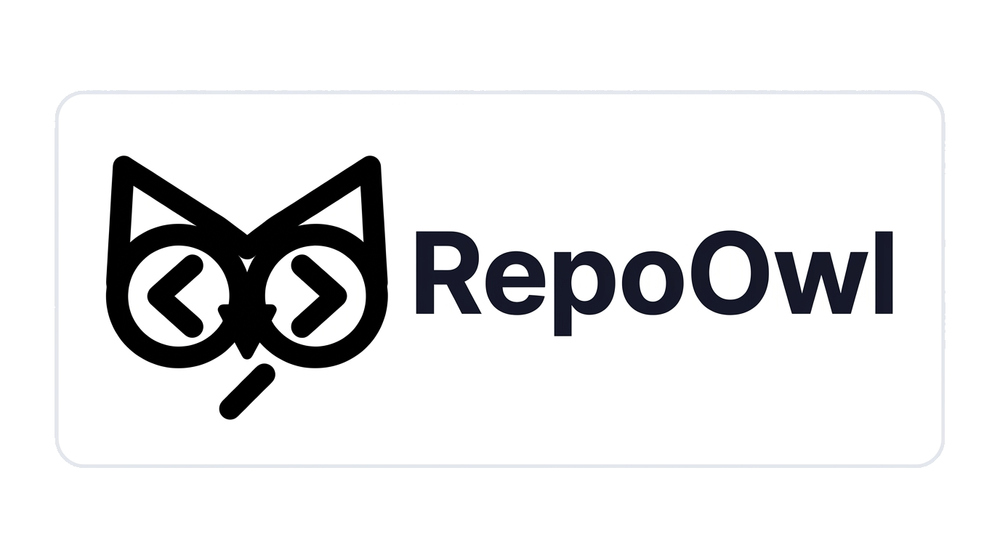

<div align="center">



**AI-powered issue triage & PR analysis, injected natively into GitHub.**

RepoOwl is a Chrome extension + GitHub Actions suite that uses **Qwen 3.6 27B (via Groq)** to automatically detect duplicate issues, score PR quality, and surface actionable technical insights — directly inside the GitHub UI, in real time.

[](https://github.com/YASHK-arch/RepoOwl-extension/stargazers)
[](https://github.com/YASHK-arch/RepoOwl-extension/forks)
[](https://github.com/YASHK-arch/RepoOwl-extension/issues)
[](https://github.com/YASHK-arch/RepoOwl-extension/pulls?q=is%3Apr+is%3Aopen)
[](https://github.com/YASHK-arch/RepoOwl-extension/pulls?q=is%3Apr+is%3Aclosed+is%3Aunmerged)
[](https://github.com/YASHK-arch/RepoOwl-extension/pulls?q=is%3Apr+is%3Amerged)
[](./LICENSE)
[](./extension/package.json)

<br />

[**Landing Page**](https://repoowl.vercel.app) · [**Report a Bug**](https://github.com/YASHK-arch/RepoOwl-extension/issues/new?template=bug_report.yml) · [**Request a Feature**](https://github.com/YASHK-arch/RepoOwl-extension/issues/new?template=feature_request.yml) · [**Good First Issues**](https://github.com/YASHK-arch/RepoOwl-extension/issues?q=is%3Aissue+is%3Aopen+label%3A%22good+first+issue%22)

</div>

---

## Overview

Managing a busy open-source repository is hard. Duplicate issues pile up. PRs carry hidden AI-generated slop. Triage takes hours.

RepoOwl solves this at **two layers**:

1. **Chrome Extension** — Injects AI-generated badges, sidebars, and insight panels directly into the GitHub DOM (Manifest V3). No page refresh needed. Looks and feels like a native GitHub feature.
2. **GitHub Actions** — Runs analysis server-side on every new issue/PR. Posts structured triage comments, applies labels, and writes results to a Supabase database that the extension reads from.

The two layers share a **Central Mediator Registry** — a Supabase Edge Function that lets any contributor's browser automatically discover the maintainer's Supabase configuration without requiring manual key sharing.

---

## ✨ Features

### For Contributors
- 🔵 **Duplicate Badges** — Issue list shows color-coded "Duplicate" / "Possible Duplicate" badges per issue
- 📋 **AI Sidebar Card** — Every issue page shows a floating card with: duplicate status, AI analysis summary, and predicted affected files
- 🔀 **PR Insights Panel** — Pull request pages display slop detection score, issue resolution coverage, domain impact, and recommended labels
- 🔍 **Insights Overlay** — Click the RepoOwl popup for a full repository overview with all tracked issues and their statuses
- ⚡ **Zero-Config Discovery** — Contributors don't need to paste any keys; the extension auto-discovers configuration via the central registry

### For Maintainers
- 🤖 **Automated Issue Analysis** — GitHub Action fires on every `issues: opened` event and on a 6-hour sweep cron; runs Qwen 3.6 27B analysis and writes results to Supabase
- 🧹 **PR Triage Action** — Analyzes every new PR for AI-generated content, issue resolution, domain impact; posts a structured triage comment
- 🏷️ **Auto-Labeling** — Automatically applies labels (`duplicate`, `possible-duplicate`, `needs-triage`, `spam`, `ai-slop`, etc.) based on AI confidence scores
- 📌 **Path-Based Label Rules** — Define custom file path → label mappings in `repoowl.json` (e.g., all PRs touching `src/auth/**` get the `auth` label)
- 👤 **Smart Issue Assignment** — Auto-assigns issue authors (unless the issue is flagged as spam/duplicate) with a `/assign` command for contributors
- 🟢 **Stale Issue Management** — Marks and closes stale issues automatically
- 🛡️ **Prompt Injection Guard** — Detects and flags issues containing prompt injection attempts
- 🔑 **OAuth Setup Flow** — 3-step in-extension wizard (GitHub OAuth → Supabase OAuth → Groq key) with one-click database provisioning

---

## 🏗️ Architecture

```
┌─────────────────────────────────────────────────────────────────┐
│                        CONTRIBUTOR'S BROWSER                    │
│                                                                 │
│  ┌──────────────────────────────────────────────────────────┐   │
│  │              Chrome Extension (Manifest V3)              │   │
│  │                                                          │   │
│  │  content.js ──► badgeInjector   (issue list badges)     │   │
│  │             ──► sidebarCard     (per-issue sidebar)      │   │
│  │             ──► prDetailInjector (PR triage panel)       │   │
│  │             ──► InsightsOverlay (full repo overlay)      │   │
│  │                                                          │   │
│  │  background.js ──► githubInstaller (GitHub Actions       │   │
│  │                     installer into target repo)          │   │
│  │                                                          │   │
│  │  popup/  ──► React popup with settings & sync status    │   │
│  │  settings/ ──► TrackedRepos, AutoTriagePanel,           │   │
│  │               ConfigurationModal (OAuth wizard)          │   │
│  └──────────────────┬──────────────────────────────────────┘   │
└─────────────────────│───────────────────────────────────────────┘
                      │ reads insights
                      ▼
┌─────────────────────────────────────────────────────────────────┐
│                     SUPABASE (MAINTAINER'S PROJECT)             │
│                                                                 │
│  Tables:                                                        │
│   issues            – per-issue AI analysis results            │
│   pull_requests     – per-PR triage results                    │
│   public_ecosystem_registry – global stats across all repos    │
│                                                                 │
│  Edge Functions (Central Hub):                                  │
│   /registry         – maintainer registration & key discovery  │
│   /supabase-provision – auto-provision DB schema via Mgmt API  │
│   /github-oauth     – GitHub OAuth PKCE token exchange         │
│   /supabase-oauth   – Supabase OAuth token exchange            │
└─────────────────────────────────────────────────────────────────┘
                      ▲ writes analysis
                      │
┌─────────────────────────────────────────────────────────────────┐
│                      GITHUB ACTIONS (CI)                        │
│                                                                 │
│  issue-analyze.yml  ──► analyze-issue.js                       │
│    Trigger: issues.opened + 6h cron sweep                      │
│    Uses: Groq (Qwen 3.6 27B), Supabase, GitHub API             │
│    Outputs: duplicate flag, analysis summary, affected files   │
│                                                                 │
│  repoowl-analyze.yml ──► analyze-pr.js                         │
│    Trigger: pull_request_target + /analyze command             │
│    Uses: Groq (Qwen 3.6 27B), GitHub API                       │
│    Outputs: slop score, issue resolution, domain impact,       │
│             recommended labels, triage comment                 │
│                                                                 │
│  Other workflows: auto-label, issue-assignment,                │
│                   welcome, stale, pr-merged                    │
└─────────────────────────────────────────────────────────────────┘
```

### Key Design Decisions

- **Dual-Layer Supabase Fetch**: The extension queries both the maintainer's *sandbox* Supabase project and the *central hub* project simultaneously. Hub results cascade-override sandbox results, ensuring contributors always get the most authoritative data.
- **Non-Destructive DOM Injection**: All UI elements are injected alongside GitHub's native DOM using `MutationObserver`. No page elements are overwritten; RepoOwl additions are visually styled to blend in.
- **Zero-Config Contributor Model**: Contributors install the extension and browse a tracked repo — no keys, no setup. The `registry` Edge Function returns the public `supabase_url` and `supabase_anon_key` for the repo automatically.
- **Prompt Injection Guard**: The AI analysis pipeline detects and flags issues containing adversarial prompt injections before they can influence LLM output.

---

## 🛠 Tech Stack

| Layer | Technology |
|---|---|
| **Chrome Extension** | Manifest V3, React 19, Vite 8, `@supabase/supabase-js` |
| **AI Inference** | Groq API — Qwen 3.6 27B (`qwen/qwen3.6-27b`) |
| **Database & Auth** | Supabase (PostgreSQL + Row-Level Security + Edge Functions) |
| **Edge Functions** | Deno (TypeScript), deployed on Supabase |
| **GitHub Automation** | GitHub Actions (7 workflows), `actions/github-script` |
| **Landing Page** | React 19, Vite 8, TailwindCSS v4, Framer Motion, OGL (WebGL) |
| **Monorepo** | npm Workspaces (`shared`, `extension`) |
| **Cryptography** | `libsodium-wrappers` (for secret encryption before storage) |

---

## 📁 Project Structure

```
RepoOwl-extension/
│
├── extension/                  # Chrome Extension (Manifest V3)
│   ├── manifest.json           # Extension manifest with permissions & CSP
│   ├── src/
│   │   ├── background/
│   │   │   └── githubInstaller.js    # Installs GitHub Actions workflows into target repos
│   │   ├── content/
│   │   │   ├── index.js              # Main content script — bootstraps everything
│   │   │   ├── badgeInjector.js      # Injects duplicate badges on issue list pages
│   │   │   ├── sidebarCard.js        # Floating sidebar card on individual issue pages
│   │   │   ├── fetchIssueInsights.js # Dual-layer Supabase fetcher (hub + sandbox cascade)
│   │   │   ├── issueDetailInjector.js# Injects AI summary on issue detail pages
│   │   │   └── prDetailInjector.js   # Injects PR triage panel
│   │   ├── overlay/
│   │   │   ├── InsightsOverlay.jsx   # Full-repo insights overlay (React)
│   │   │   └── OverlayRoot.jsx       # Shadow DOM mount for the overlay
│   │   ├── popup/
│   │   │   └── PopupApp.jsx          # Extension popup UI (repo stats, sync buttons)
│   │   ├── settings/
│   │   │   ├── ConfigurationModal.jsx# 3-step OAuth setup wizard
│   │   │   ├── TrackedRepos.jsx      # Manage tracked repos, mediator sync status
│   │   │   ├── AutoTriagePanel.jsx   # Configure triage thresholds & path-label rules
│   │   │   ├── ModelConfig.jsx       # AI model & prompt configuration
│   │   │   └── PromptSettings.jsx    # Custom prompt template editor
│   │   └── lib/
│   │       ├── supabase.js           # Supabase client factory (sandbox + hub)
│   │       ├── oauth.js              # GitHub & Supabase OAuth flows
│   │       ├── githubContext.js      # GitHub page URL/DOM parser
│   │       └── schema.js            # DB schema constants for provisioning
│   └── vite.*.config.js             # Separate Vite configs for each bundle target
│
├── shared/                     # @repoowl/shared — npm workspace package
│   ├── prompts/
│   │   └── defaultPrompt.js          # System-default Qwen 3.6 27B prompt template
│   ├── schemas/
│   │   └── groqResponseSchema.js     # JSON schema for Groq response validation
│   └── utils/
│       ├── renderPrompt.js           # Template variable renderer
│       └── formatHistoricalContext.js# Formats historical issues for prompt context
│
├── supabase/                   # Supabase Edge Functions & config
│   ├── config.toml
│   ├── functions/
│   │   ├── registry/           # Maintainer registration & contributor key discovery
│   │   ├── supabase-provision/ # One-click DB schema provisioning via Management API
│   │   ├── github-oauth/       # GitHub OAuth token exchange
│   │   ├── supabase-oauth/     # Supabase OAuth token exchange
│   │   └── _shared/            # Shared schema SQL embedded in Edge Functions
│   └── migrations/             # SQL migration files
│
├── repoowl-web-react/          # Marketing landing page (separate Vite app)
│   └── src/
│       └── components/         # HeroSection, BentoSection, SetupSection, etc.
│
├── .github/
│   ├── workflows/
│   │   ├── issue-analyze.yml         # AI issue analysis (fires on issue open + 6h cron)
│   │   ├── repoowl-analyze.yml       # AI PR analysis (fires on PR open + /analyze)
│   │   ├── issue-assignment.yml      # Auto-assign + /assign command
│   │   ├── auto-label.yml            # Path-based auto-labeling
│   │   ├── welcome.yml               # Welcome message for first-time contributors
│   │   ├── stale.yml                 # Stale issue management
│   │   └── pr-merged.yml             # Post-merge actions
│   ├── scripts/
│   │   ├── analyze-issue.js          # Core issue analysis Node.js script
│   │   └── analyze-pr.js             # Core PR analysis Node.js script
│   └── ISSUE_TEMPLATE/               # 10 structured issue templates
│
├── database-schema.sql         # Full idempotent SQL schema (issues, pull_requests, registry)
├── repoowl.json                # Per-repo config: Supabase keys + path-label rules
├── .env.example                # Template for all required environment variables
├── package.json                # Root npm workspace config
├── CONTRIBUTING.md
├── SECURITY.md
├── CODE_OF_CONDUCT.md
└── LICENSE                     # Apache-2.0
```

---

## 🚀 Getting Started

RepoOwl's setup is entirely streamlined through the Chrome Extension UI. There is no need for manual database migrations or copying YAML files—the extension handles it all!

Choose one of the paths below based on your needs:

### Option A: Testing / Using the Extension (Recommended)

Use this method if you want to install RepoOwl on your own GitHub repository to analyze issues and PRs.

#### 1. Download & Install
1. Download the latest `repoowl-production-release.zip` from the [Releases page](https://github.com/YASHK-arch/RepoOwl-extension/releases) (or build it locally).Th extension zip can be downloaded directly from the landing vercel deployed page too  --> https://repoowl-extension.vercel.app/
2. Unzip the downloaded file.
3. Open your browser and navigate to `chrome://extensions/`.
4. Enable **Developer mode** (top-right corner).
5. Click **Load unpacked** and select the unzipped folder.

#### 2. Configure via the Setup Wizard
1. Click the RepoOwl 🦉 icon in your browser toolbar.
2. The UI will guide you through a simple 3-step setup:
   - **GitHub Connect**: Authorizes RepoOwl to read your repository and install the background workflows.
   - **Supabase Connect**: Connects to your free Supabase project and **automatically provisions the required database tables** using the Management API.
   - **Groq API**: Paste your Groq API key (get one [here](https://console.groq.com/keys)).

#### 3. One-Click Repository Installation
1. Navigate to your GitHub repository in your browser.
2. Open the RepoOwl side panel (by clicking the extension icon).
3. The extension will automatically detect your repository and ask you to configure the required AI Triage GitHub Actions workflows into your repo's `.github/workflows/` directory.

You're done! RepoOwl is now monitoring your repository.

---

### Option B: Local Development

Use this method if you want to modify the extension's code or develop new features.

#### 1. Clone & Install
```bash
git clone https://github.com/YASHK-arch/RepoOwl-extension.git
cd RepoOwl-extension
npm install
```

#### 2. Build the Extension
```bash
cd extension
npm run build
```

#### 3. Load into Chrome
1. Navigate to `chrome://extensions/`
2. Enable **Developer mode**
3. Click **Load unpacked** and select the `extension/dist/` folder.

Whenever you make changes to the extension code, run `npm run build` again and click the "Refresh" icon on the extension in `chrome://extensions/`.

#### 4. Running the Landing Page Locally
If you wish to modify the marketing landing page:
```bash
cd repoowl-web-react
npm run dev
# Opens at http://localhost:5173
```

---

## ⚙️ Configuration

### Per-Repo Config (`repoowl.json`)

Commit a `repoowl.json` file to the **root of your target repository** to configure path-based auto-labeling:

```json
{
  "supabaseUrl": "https://your-project.supabase.co",
  "supabaseAnonKey": "your-anon-key",
  "path_labels": {
    "src/auth/**": { "label": "auth", "color": "#e11d48" },
    "docs/**": { "label": "documentation", "color": "#0969da" },
    "src/api/**": "api"
  }
}
```


## 🗄️ Database Schema

Four tables with Row-Level Security enabled:

```sql
-- Issue AI analysis results (per-repo)
issues (
  id, repo_name, issue_number,
  is_duplicate BOOLEAN,
  analysis_summary TEXT,
  affected_files JSONB,  -- Array of predicted affected file paths
  status TEXT,
  created_at
)

-- PR triage results (per-repo)
pull_requests (
  id, repo_name, pr_number,
  slop_detection JSONB,
  issue_resolution JSONB,
  domain_impact JSONB,
  recommended_labels JSONB,
  created_at
)

-- Global ecosystem stats (cross-repo dashboard)
public_ecosystem_registry (
  repo_name PRIMARY KEY,
  total_issues_analyzed INT,
  duplicates_found INT,
  maintainer_handle TEXT,
  last_updated
)

-- Central mediator: maps repo → Supabase credentials for contributor discovery
registry (
  owner TEXT, repo TEXT,  -- composite PK
  supabase_url TEXT,
  supabase_anon_key TEXT,
  created_at
)
```

**RLS Policies**: Public read on all tables. Writes via authenticated/anon role for issues and PRs. Registry writes are managed exclusively by the `registry` Edge Function using the service role key.

---

## 🤖 GitHub Actions Workflows

### `issue-analyze.yml` — Issue Analysis

**Triggers**: `issues: [opened]` + scheduled sweep every 6 hours  
**Script**: `.github/scripts/analyze-issue.js`

1. Fetches full issue body and parses it using the structured template fields
2. Retrieves repository file tree (up to 500 paths) for context
3. Fetches historical issue summaries from Supabase as duplicate context
4. Sends to Groq (`qwen/qwen3.6-27b`) with the default prompt template
5. Writes `{ is_duplicate, analysis_summary, affected_files }` to Supabase
6. Applies labels (`duplicate`, `possible-duplicate`, `needs-triage`) based on result

### `repoowl-analyze.yml` — PR Triage

**Triggers**: `pull_request_target: [opened, ready_for_review]` + `/analyze` comment  
**Script**: `.github/scripts/analyze-pr.js`

1. Fetches PR diff, title, body, and linked issues
2. Runs Qwen 3.6 27B analysis for: slop detection score, issue resolution, domain impact
3. Recommends labels based on file paths changed
4. Posts a structured triage comment to the PR
5. Writes results to the `pull_requests` Supabase table

### Other Workflows

| Workflow | Trigger | Description |
|---|---|---|
| `issue-assignment.yml` | `issues`, `issue_comment` | Auto-assigns author; handles `/assign` command |
| `auto-label.yml` | `pull_request_target` | Applies path-based labels from `repoowl.json` |
| `welcome.yml` | First issue/PR from a user | Posts a welcome message to first-time contributors |
| `stale.yml` | Scheduled | Marks and closes stale issues after inactivity |
| `pr-merged.yml` | `pull_request: closed` (merged) | Post-merge acknowledgement actions |


## 🤝 Contributing

We welcome all contributions! Please read the full [`CONTRIBUTING.md`](./contributing.md) before opening a PR.

**Quick start:**

1. **Fork** this repository
2. **Clone** your fork:
   ```bash
   git clone https://github.com/YOUR_USERNAME/RepoOwl-extension.git
   cd RepoOwl-extension
   npm install
   ```
3. **Add upstream remote:**
   ```bash
   git remote add upstream https://github.com/YASHK-arch/RepoOwl-extension.git
   ```
4. **Create a branch** following the naming convention:
   - `feature/<name>` — new features
   - `bug/<name>` — bug fixes
   - `docs/<name>` — documentation
   - `refactor/<name>` — code refactoring
   - `test/<name>` — adding/updating tests
5. **Make your changes**, then run tests and lint
6. **Commit** using [Conventional Commits](https://www.conventionalcommits.org/):
   - `feat:` · `fix:` · `docs:` · `refactor:` · `style:` · `test:`
7. **Sync with upstream** before pushing:
   ```bash
   git pull upstream main
   ```
8. **Open a Pull Request** — fill out the PR template completely

Pick a [good first issue](https://github.com/YASHK-arch/RepoOwl-extension/issues?q=is%3Aissue+is%3Aopen+label%3A%22good+first+issue%22) if you're just getting started!

### Issue Templates

We have 10 structured issue templates to guide submissions:

| Template | Use for |
|---|---|
| `bug_report` | Something is broken |
| `feature_request` | New capability request |
| `good_first_issue` | Beginner-friendly tasks |
| `documentation` | Docs improvements |
| `performance` | Speed / memory regressions |
| `refactor` | Code quality improvements |
| `security` | Security concerns (use `SECURITY.md` for private disclosures) |
| `ui_improvement` | Visual / UX changes |
| `test_coverage` | Missing or failing tests |

---

## 🗺️ Roadmap

- [x] Chrome Extension (Manifest V3) with badge injection
- [x] Groq + Qwen 3.6 27B (`qwen/qwen3.6-27b`) issue duplicate detection
- [x] GitHub Actions issue analysis pipeline
- [x] GitHub Actions PR triage pipeline
- [x] Central Mediator Registry (zero-config contributor discovery)
- [x] 3-step OAuth configuration wizard
- [x] One-click Supabase database provisioning
- [x] Prompt injection detection & guarding
- [x] Path-based auto-labeling (`repoowl.json`)
- [x] Dual-layer Supabase fetch with cascade merge
- [x] React landing page (`repoowl-web-react`)
- [ ] Firefox / Edge extension support
- [ ] Webhook-based real-time issue analysis (replacing polling)
- [ ] Multi-repo analytics dashboard
- [ ] Custom AI model support (beyond Groq)
- [ ] VSCode extension integration
- [ ] Public Chrome Web Store listing

---

## 🔒 Security

Please **do not** open a public GitHub issue to report a security vulnerability.

Instead:
- Use the **GitHub Security Advisory** feature in this repository, or
- Email the maintainers directly

We will acknowledge receipt within **48 hours**, provide an initial assessment within **1 week**, and deliver a fix within **1–3 weeks** depending on severity.

See [`SECURITY.md`](./SECURITY.md) for the full disclosure policy.

---

## 👥 Contributors

Thanks to everyone who has helped build RepoOwl. Want to see your avatar here? Pick a [good first issue](https://github.com/YASHK-arch/RepoOwl-extension/issues?q=is%3Aissue+is%3Aopen+label%3A%22good+first+issue%22) and send a PR.

<div align="center">
  <a href="https://github.com/YASHK-arch/RepoOwl-extension/graphs/contributors">
    
  </a>
</div>

---

## 🙏 Acknowledgements

- [**Groq**](https://groq.com) — blazing-fast LLM inference powering the analysis pipeline
- [**Supabase**](https://supabase.com) — database, auth, and edge functions in one platform
- [**Qwen 3.6 27B**](https://huggingface.co/Qwen/Qwen3-27B) by Alibaba Cloud — the underlying language model (`qwen/qwen3.6-27b` via Groq)
- [**contrib.rocks**](https://contrib.rocks) — contributor avatar grid
- [**Framer Motion**](https://www.framer.com/motion/) & [**OGL**](https://oframe.github.io/ogl/) — landing page animations

---

## 📜 License

Distributed under the **Apache-2.0 License**. See [`LICENSE`](./LICENSE) for full terms.

---

<div align="center">
  <sub>Built with 🦉 by the RepoOwl community</sub>
</div>
